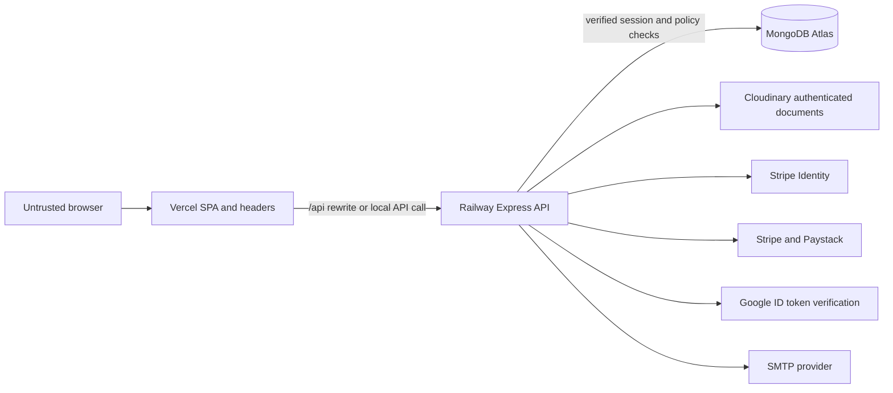

# Glory Security Architecture

## Request flow

## Implemented controls

- Access token: 15-minute signed HttpOnly cookie with HS256, issuer and audience checks.
- Refresh token: 48 random bytes, stored only as a SHA-256 hash, rotated on refresh and revocable server-side.
- Cookies: `Secure` in production, HttpOnly, `SameSite=None` only because Vercel/Railway can be cross-site; CSRF is mandatory for unsafe application routes.
- Authorization: current user comes from the verified session; ownership checks remain server-side. Administrator access requires server-side `isAdmin` plus MFA. Role elevation requires `isSuperAdmin` plus MFA.
- Inputs: request-body limits, Mongo operator sanitization, HPP protection, allowlist validators and update-field allowlists.
- Files: exact content signature checks, size limits, non-executable formats, Cloudinary authenticated document storage.
- Logging: request IDs, path-only structured HTTP logs, hashed IPs, redacted common secrets and audit events.
- Frontend: CSP and HTTPS-oriented headers in `C:\Users\ADMIN\OneDrive\Desktop\glory-frontend\vercel.json`.

## Required production environment variables

Set these only in Railway, never in Git or Vercel frontend variables:

- `JWT_SECRET`: new random value, at least 32 characters.
- `OTP_SECRET`: different new random value, at least 32 characters.
- `RATE_LIMIT_KEY_SECRET`, `LOG_HASH_SECRET` and `SESSION_IP_SALT`: distinct random values, at least 32 characters.
- `JWT_ISSUER=glory-store-api`, `JWT_AUDIENCE=glory-web`, `SESSION_IDLE_HOURS=24`, `BCRYPT_ROUNDS=12`.
- `CORS_ORIGINS`: exact frontend origins, for example `https://glory-ca.vercel.app` and any approved custom domain.
- Provider secrets only for services currently enabled. Remove unused Stripe, Paystack, SMTP and Cloudinary credentials.

## Required dashboard configuration

1. Atlas: rotate the disclosed password, create a least-privilege application user, restrict Network Access to Railway egress/private networking, enable backups and test a restore.
2. Railway: set production variables, keep only the web service public, do not expose MongoDB/Redis ports, add a Redis service for rate-limit storage, set spend alerts and restrict project access with MFA.
3. Vercel: retain `glory-ca.vercel.app` as the only production alias unless intentionally changed, enable deployment protection for previews, restrict team membership, and configure only public `VITE_*` values.
4. Cloudinary: require authenticated delivery for documents, disable unsigned presets, set upload presets/folder restrictions, enable moderation or malware scanning where available.
5. Stripe/Paystack: verify live webhook secrets, use restricted keys, enable provider fraud controls and billing alerts, and never mark payments paid from a browser callback alone.
6. Domain and email: registrar lock, MFA/passkeys, DNSSEC where supported, SPF, DKIM and DMARC with monitoring.
